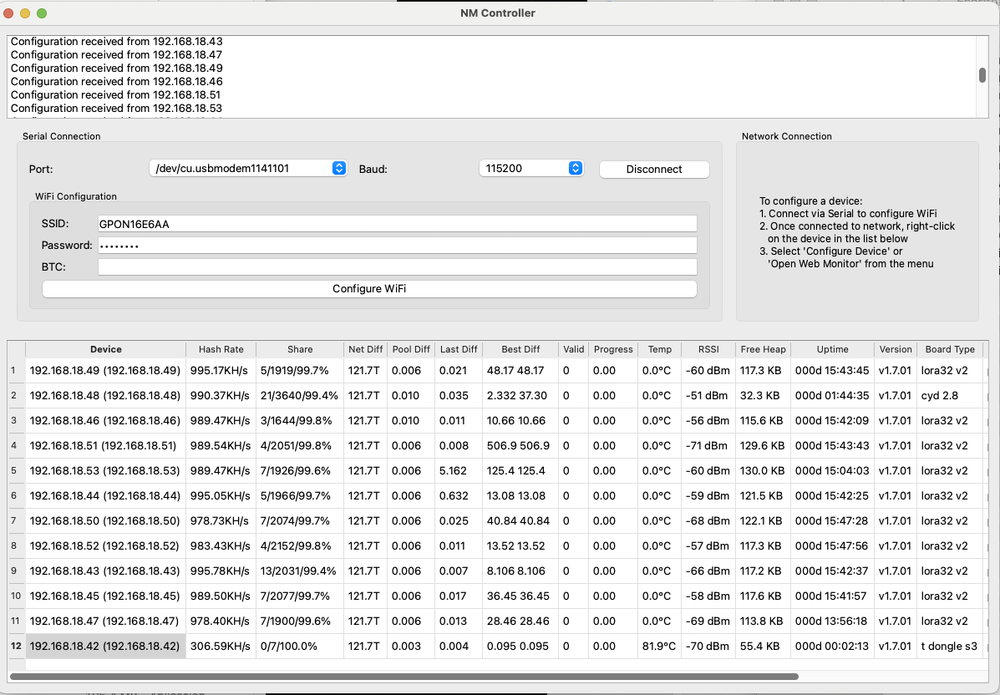

# NM Controller

A desktop application for monitoring and managing network mining devices. The application provides a user-friendly interface to connect to and monitor mining devices through both serial and network connections.

## Features

- **Dual Connection Support**
  - Serial connection for direct device communication
  - Network connection for remote device management
  - Automatic device discovery and connection

- **Real-time Monitoring**
  - Hash rate tracking
  - Share submission monitoring
  - Network and pool difficulty statistics
  - Device temperature and performance metrics
  - RSSI signal strength
  - Memory usage (Free Heap)
  - Device uptime tracking

- **Device Management**
  - Individual device configuration
  - Web-based monitoring interface access
  - Context menu for quick device actions
  - Automatic device status updates

- **User Interface**
  - Tabbed interface for different connection types
  - Real-time device status table
  - Log window for operation feedback
  - Device configuration window
  - Network device discovery

## Screenshot



## Requirements

- Python 3.9 or higher
- PySide6 6.6.1
- pyserial 3.5

## Installation

1. Clone the repository
2. Install the required dependencies:
   ```bash
   pip install -r requirements.txt
   ```

## Building

### Windows
Run the `build_windows.bat` script to create a Windows executable.

### macOS
Run the `build_macos.sh` script to create a macOS application bundle.

## Usage

1. Launch the application
2. Choose your connection method:
   - Serial: Select the port and click "Connect"
   - Network: Select the device from the list and click "Connect"
3. Monitor device status in the main table
4. Use the context menu (right-click) on devices for additional options:
   - Configure Device
   - Open Web Monitor

## License

This project is licensed under the MIT License - see the LICENSE file for details. 